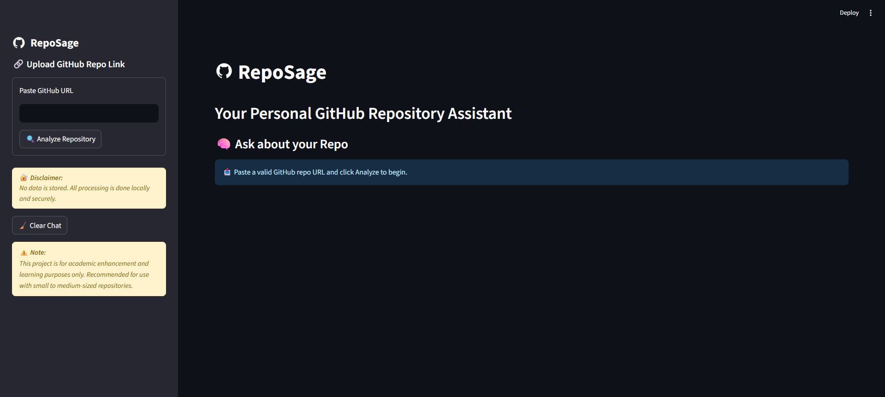

# 🧠 RepoSage – GitHub Repository Explainer with RAG + GenAI

RepoSage is an AI-powered tool designed to analyze GitHub repositories intelligently and answer questions about the repo content using a chatbot interface. It leverages **RAG (Retrieval-Augmented Generation)**, **LangChain**, **FAISS**, and the **Groq LLM API** (non-Mistral model) to provide smart and interactive Q&A support for developers and learners.

---

## 🚀 Tech Stack Used

| Layer      | Technology                          |
|------------|-------------------------------------|
| Frontend   | Streamlit (custom-styled)           |
| Backend    | Python, LangChain, Groq API         |
| Vector DB  | FAISS                               |
| Embeddings | HuggingFace Sentence Transformers   |
| Parsing    | GitHub API, Unstructured for file parsing |
| Models     | LLaMA3 via Groq                     |

---

## 🛠️ Backend Flow


## 💡 Features

- 🔍 Auto-fetch all files & folders from public GitHub repositories
- 🧠 Context-aware Q&A chatbot using GenAI (Groq LLM)
- 🗂️ Supports various file types including code, markdown, configs, docs
- 🧾 Follow-up questions supported with memory
- 🗃️ Temporary storage using FAISS for fast retrieval
- 🎨 Sleek Streamlit UI with left/right aligned Q&A
- ❌ Chat Clear button
- ⚠️ Bottom sidebar disclaimer block

---

### ⚙️ Installation & Deployment

```bash
# 1. Clone repo & setup venv
git clone https://github.com/your-username/RepoSage.git
cd RepoSage
python -m venv .venv && source .venv/bin/activate  # use .venv\Scripts\activate on Windows

# 2. Install dependencies
pip install -r requirements.txt

# 3. (Optional) Create .env for local dev only
import dotenv -> load_dotenv()
echo "GROQ_API_KEY=your_key_here" > .env  # Make sure .env is in .gitignore

# 4. Run locally
streamlit run app.py
```

#### 🚀 Streamlit Cloud Deployment
- Don’t use `.env`. Go to **Settings → Secrets** in Streamlit Cloud.
- Add:
  ```toml
  GROQ_API_KEY = "your_groq_api_key_here"
  ```

✅ App will auto-use `st.secrets["GROQ_API_KEY"]`


---

## 🟡 Disclaimer

> 📘 **Note**: This project is designed purely for academic and learning purposes. For best results, use small to medium-sized public repositories only.

---

## 📂 Example Repositories to Try

- https://github.com/orophile07/AI-Career-Advisor
- https://github.com/Aiswariyat/GenAI-RAG-Chatbot

---

---

## 📧 Contact

For academic collaboration or questions, feel free to raise an issue or connect!


